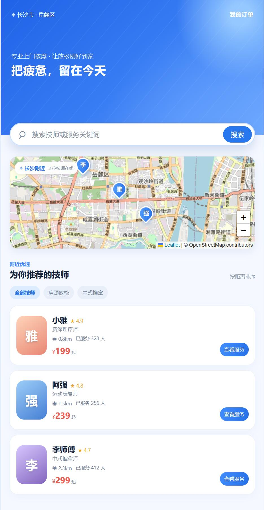

# 罗汉到家 - 上门按摩预约 MVP

基于 LBS 模拟数据的上门按摩预约 MVP。项目覆盖“浏览技师 → 选择服务 → 预约下单 → 订单任务 → 状态管理”的核心流程。

## 功能

- 技师列表、关键词搜索与长沙附近 Leaflet 地图
- 技师服务选择与预约时间选择
- 订单任务页、订单详情页、历史订单页
- FastAPI + SQLite 持久化技师与订单数据
- 订单状态：待接单、已接单、服务中、已完成

## 技术结构

```text
React + Vite
  ↓ HTTP API
FastAPI
  ↓
SQLite（backend/luohan.db）
```

前端本地的 `src/data/technicians.js` 只补充头像、地图坐标、服务说明等展示信息；技师评分、距离、价格和全部订单数据均来自后端接口。

## 本地启动

需要同时启动后端和前端。

### 1. 启动后端

```powershell
cd backend
python -m pip install -r requirements.txt
python -m uvicorn main:app --port 8100
```

首次启动会自动创建 `backend/luohan.db`，并初始化 3 位技师。

### 2. 启动前端

在项目根目录新开一个终端：

```powershell
pnpm install
pnpm run dev
```

打开终端显示的地址，通常为 `http://localhost:5173`。前端会请求 `http://127.0.0.1:8100`。

如果没有 pnpm，也可以使用：

```powershell
npm install
npm run dev
```

## API

| 方法 | 接口 | 说明 |
| --- | --- | --- |
| GET | `/technicians` | 获取技师列表 |
| POST | `/orders` | 创建订单 |
| GET | `/orders` | 获取历史订单 |
| PUT | `/orders/{id}/status` | 更新订单状态 |

创建订单请求示例：

```json
{
  "technician_id": 1,
  "service_name": "精油推背",
  "price": 299,
  "date": "2026-07-30",
  "time": "14:00"
}
```

## 验证方式

1. 首页确认可显示 3 位初始化技师及其地图标记。
2. 选择服务并确认下单，订单任务页会跳转到 `/order-status/:id`。
3. 在订单详情页推进状态后刷新页面，状态仍会从 SQLite 读取。
4. 打开“我的订单”，最新订单会排在最前。

`backend/luohan.db` 是运行时生成的数据文件，已被 Git 忽略，不会提交到仓库。

## MVP 截图

### 首页与技师地图



### 我的订单


### 订单详情与状态推进


## 暂不包含

- 用户登录、权限和技师端
- 支付系统
- 真实定位与生产级地图服务
- 后台管理和复杂业务分层
