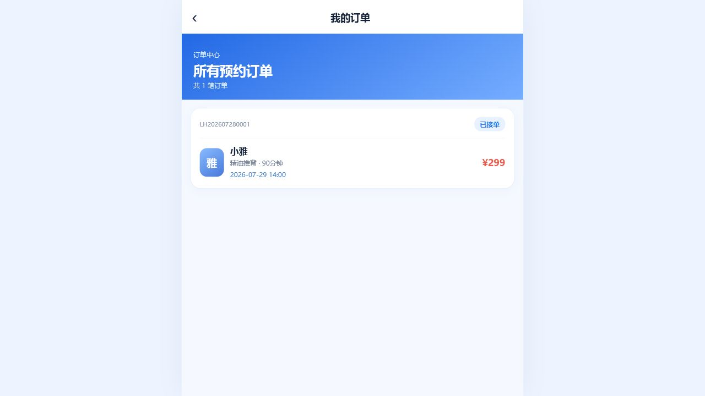
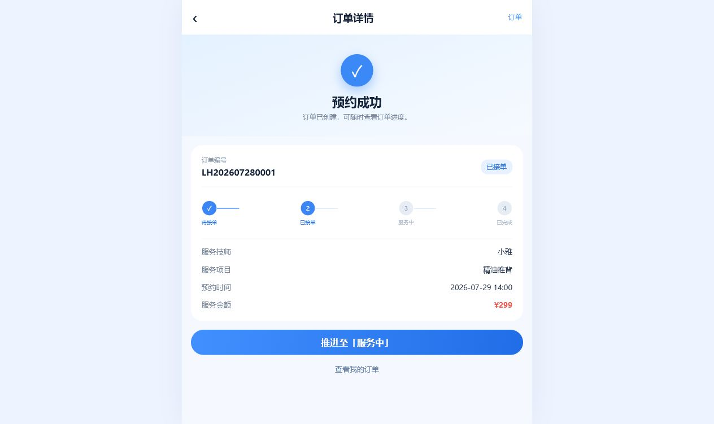

# 罗汉到家 - 上门按摩预约 MVP

## 项目背景

基于 LBS 模拟数据的上门按摩预约 MVP 原型。项目聚焦用户从浏览附近技师、选择服务、提交预约到管理订单状态的核心业务闭环。

当前版本使用前端模拟数据和 LocalStorage 完成演示，不包含真实登录、支付、后端接口或数据库。

## 产品流程

```text
技师浏览（列表 + 长沙地图）
        ↓
服务选择
        ↓
预约提交
        ↓
订单任务生成
        ↓
订单状态管理
```

## 核心功能

- 按距离排序的长沙附近技师列表与关键词搜索
- Leaflet + OpenStreetMap 技师地图，点击 Marker 查看技师信息
- 技师详情及服务项目选择
- 未来三天日期与时段预约
- 下单后的订单任务加载页
- 历史订单列表与按订单 ID 查询详情
- 订单状态推进：待接单、已接单、服务中、已完成
- 使用 LocalStorage 持久化全部订单

## MVP 截图

### 首页与技师地图


### 我的订单



### 订单详情与状态推进



## 技术架构

```text
React
  │
React Router
  │
页面组件 / 订单服务
  │
LocalStorage + Mock Data
  │
Leaflet + OpenStreetMap
```

订单读写逻辑集中在 `src/services/orderService.js`，页面组件仅负责展示和调用服务，订单数据使用 `luohan_orders` 存储在浏览器中。

## 本地启动

```bash
pnpm install
pnpm run dev
```

浏览器打开终端中显示的本地地址，通常为 `http://localhost:5173`。

如未安装 pnpm，也可以使用：

```bash
npm install
npm run dev
```

## 技术栈

- React
- Vite
- React Router
- Leaflet
- OpenStreetMap
- LocalStorage
- Mock Data

## 后续扩展

- 后端 API 与数据库
- 用户登录和地址管理
- 在线支付
- 技师端订单管理
- 技师实时定位与真实 LBS
- 订单通知与评价体系
